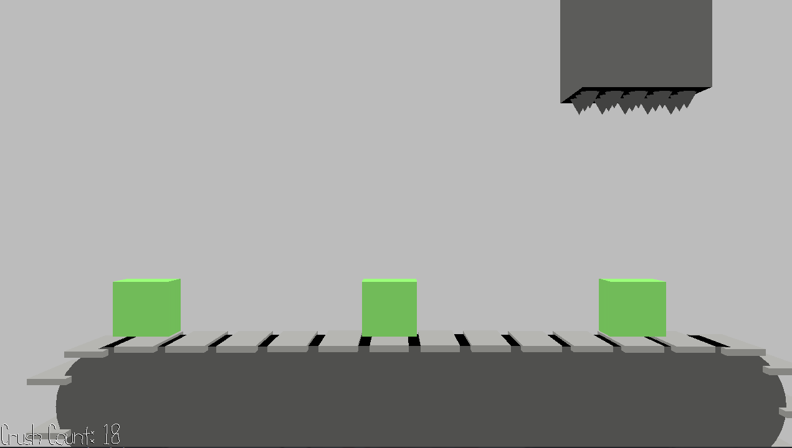

# Slime Crusher

Author: Yifan Jiang (yifanj3)

Design: This is a rhythm game where slimes move along a moving conveyor belt in sync with the drum beats in background music. Players must press space at the right moment to crush the slime when it reaches the crusher.

Screen Shot:

How To Play:

Listen to the drum beats in the background music and press `Space` when a slime is right under the crusher.

This game was built with [NEST](NEST.md).
